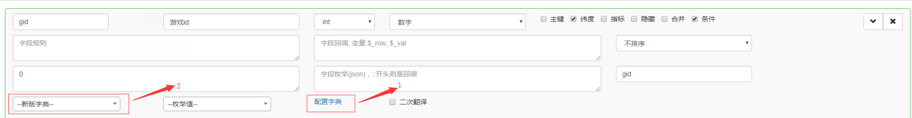
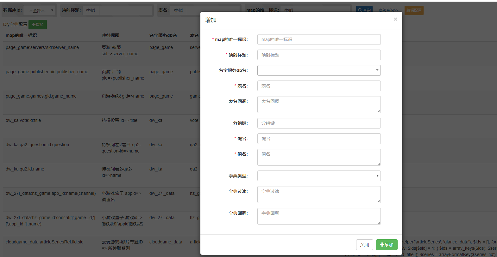

# 字典配置

在添加功能过程中，可能会出现源表中的某个字段是其他表中的字段，可能需要通过这个字段获取其他表的信息，这时候可以通过字典完成数据关联，关联以后，diy页面中所有该字段的展示都会替换成对应的关联内容。

## 选择字典

- 可以通过`页面配置管理`=>`查询功能`中的标注1进入字典配置，也可以通过`快码后台 =》系统管理 =》DIY系统 =》字典管理`进入
- 可以通过标注2的**--新版字典--**的下拉框选择对应的字典

## 新增字典

- map的唯一标识：推荐格式 **数据库名:表名:key字段名:value字段名**
- 映射标题 ：推荐格式 **diy页标题 key字段名=>value字段名**
- 名字服务db名：字典所在数据库，数据库必须存在于名字服务中
- 表名：字典所在数据表
- 键名：关联的字段名
- 值名：被关联内容的字段名
- 值名可以根据展示需要使用sql修改，如：concat('\[',gid,'\]\[',game_name,'\]')   展示效果 => \[1\]\[魔域\]
- 字段过滤：用于过滤查询条件，例如：enable = 1

