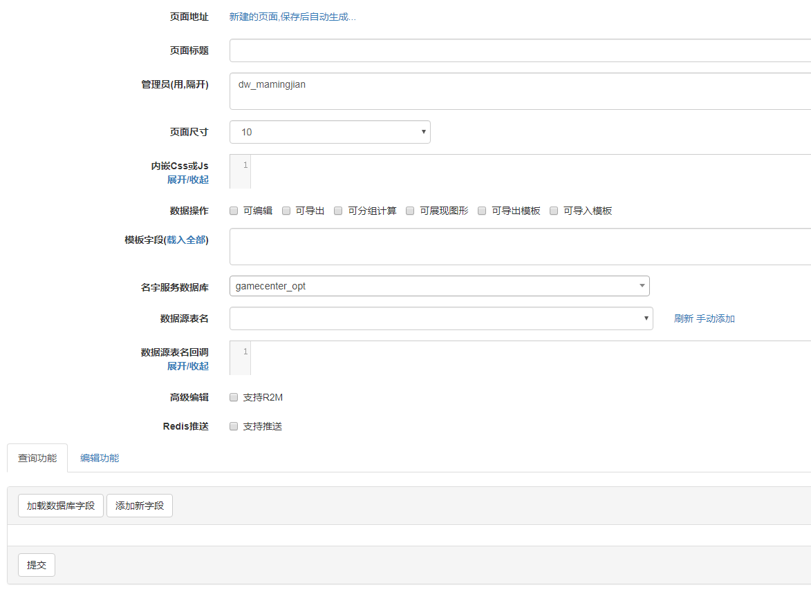
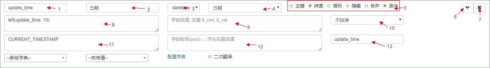
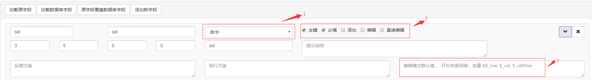

# 页面配置管理

**[1. 新增页面](#新增页面)** <br>
**[2. 页面配置](#页面配置)** <br>
**[3. 查询字段配置](#查询字段配置)** <br>
**[4. 编辑字段配置 ](#编辑字段配置 )**

## 新增页面 

从 `快码后台 =》系统管理 =》DIY系统` 中的`新建`，打开页面配置管理

## 页面配置 


- 页面标题：推荐使用项目名-自定义名称的格式命名，eg：27小程序-库存游戏
- 页面尺寸：控制数据分页时每页的数据数量
- 内嵌Css或Js：为页面注入css和js，例如：

```html
<script>
$(document).on('diy_load_table', function() {
   ...
});
</script>

<style>
body {color:#fff;}
</style>
```
- 数据操作：提供后台功能的重用操作
>   - 可编辑：提供可以编辑功能
>   - 可导出：可将页面结果导出一份Excel表
>   - 可分组计算：勾上后，就可以对页面数据进行分组、计数、求和、求最大/最小值等统计操作；
>   - 可展现图形：支持用柱状图、折线图、饼图展现统计结果；
>   - 可导出模板：可将页面结果导出一份Excel表；
>   - 可导入模板：将Excel表中的数据导入数据库中

- 保存回调：在数据添加或编辑时提供回调
- 名字服务数据库：选择导入数据库，这里的数据库必须在名字服务中已配置，方法请查看 [数据库配置](/chapter1/database-setting.md)
- 数据源表名：选好数据库后，点击右侧的刷新链接，然后选择数据表
- 数据表名回调：为查询的数据表名提供回调方法，可以控制查询的表名
- 高级编辑：设置编辑成功以后自动更新对应的redis缓存
- 推送Redis：通过向Redis的channel推送消息，以完成和其他客户端（如Java）的约定事件
- 点击加载数据库字段，加载字段配置列表。

## 查询字段配置 

- 加载原字段按钮的效果是还原最近保存的编辑字段，源字段覆盖数据库字段的效果是在当前的字段状态下，加载当前不存在的源数据库字段，添加新字段则可以增加数据库中不存在的展示字段
- 标注1为字段名，标注2为字段注释，标注3为字段类型，标注4为作为查询条件时的输入框类型
- 标注5中为字段的一些显示配置，**纬度**即分组(Group By)的键,**指标**即为需要统计或者保留的字段，同时，纬度和指标影响是否在查询结果中展示，条件选项决定字段是否可以在查询配置中出现；
- `标注8`和`标注9`都可以注入代码对数据进行处理。`标注8`可以注入sql，`标注9`则可以注入php代码，注意标注9中的回调要使用return返回结果
- 标注11位查询结果的默认值，可以使用php代码进行回调，使用php代码回调时以::开头
- 标注12是对字段值得枚举配置，一般使用json，同时，数据表的注释以  **简介：key:value(,key:value)...** 的格式定义时，加载数据表会把注释转化成对应的json
- 配置好所有需要字段的选项后，点击页面左下的'提交'按钮创建一张diy页面
- 提交以后回到页面顶部的**页面地址**，点击链接打开diy页面进行之后的配置

## 编辑字段配置 

- 标注1为编辑模式输入框的形式
- 标注2中必填限制表单提交为必填项，添加/编辑则控制该字段在这两个模式下是否显示，直接编辑选项可以让字段可以在查询展示表格中快速编辑
- 标注3为编辑模式下字段内容为空是的默认填充值