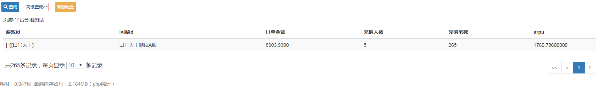
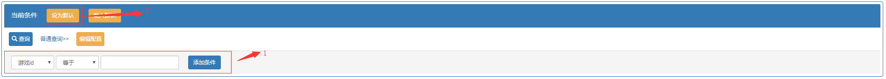

# 查询条件配置

通过diy页面的`高级查询>>`进入查询条件编辑模式

- 标注1为查询条件添加的位置，可以选择相应的查询字段和查询条件
>   * 可选查询字段为`页面配置管理`=>`查询功能`中选择了条件选项的字段
>   * 查询字段的输入框格式为`页面配置管理`=>`查询功能`中选择了字段输入框类型
>   * 配置的输入框可以填入页面打开时的默认查询值
>   * 可以拖动已添加的查询条件调整位置

- 添加好查询条件以后可以通过标注2的`设为默认`按钮保存查询设置，刷新页面，即可看到查询条件
- 有默认值或者有查询内容的查询条件，在编辑模式下会无法删除，需要把地址栏中的条件先删掉，在打开重新页面编辑

