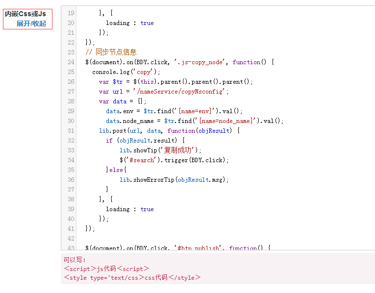
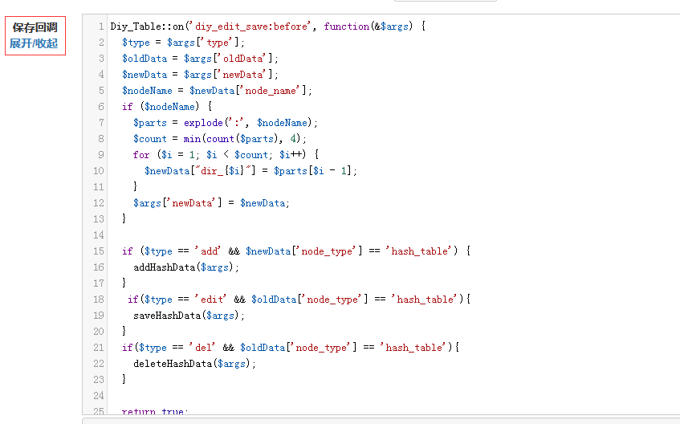
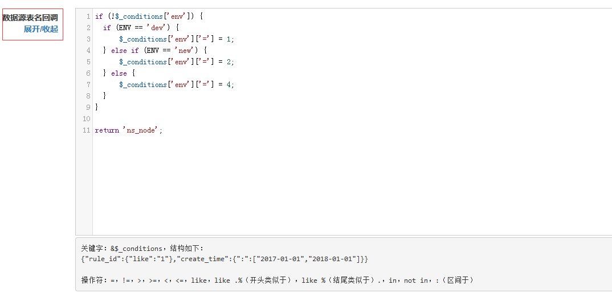
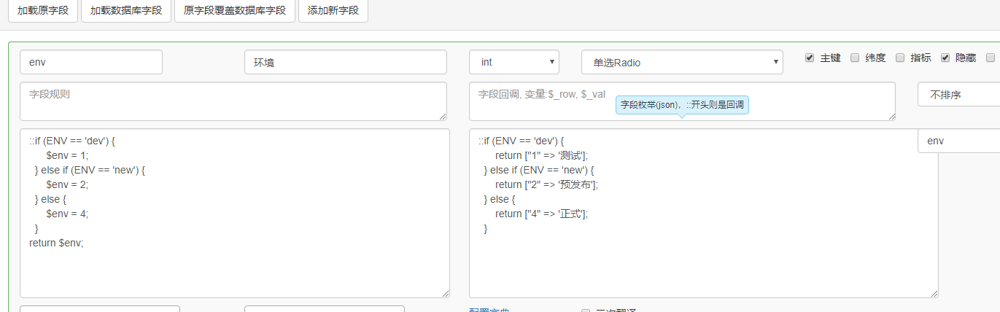

# 注入和回调

以[名字服务配置]("http://admin.duowan.com/#!nodeId=7449")为例子说明
所有以php代码进行的回调， 回调代码都可以使用phpbase2框架的方法，如创建数据库连接

**[1. 内嵌Css或Js](#内嵌Css或Js)**  
**[2. 保存回调](#保存回调)**  
**[3. 数据库表名回调](#数据库表名回调)**  
**[4. 字段回调 ](#字段回调 )**

## 内嵌Css或Js 

插入时遵循**＜script＞js代码＜script＞＜style type='text/css＞css代码＜/style＞**

## 保存回调 

- **保存回调**需要先勾选可编辑选项
- 回调结束需要return 结果，否则回调处理不生效
- 使用回调方法Diy_Table:on('eventName', function($args) {  })处理回调逻辑
- 自定义的方法或者类可以在回调方法Diy_Table::on外定义，回调方法内直接调用即可
- 回调方法的event可分为：
> diy_edit_save:before 添加／保存／删除 前置事件，返回false会终止操作
> diy_edit_save:after 添加／保存／删除 后置事件
> diy_edit_import:before 导入 前置事件，参数：\&\$rows
> diy_edit_import:after 导入 后置事件，参数：\&\$rows

- 可以通过回调函数的\$args传参获取保存过程的一些相关数据，$args参数：
> type 保存类型(eg:add,edit,del)
> newData 提交时的数据集（注意，编辑模式提交的数据没有变更，不会存放到newData，需要从oldData中获取）
> oldData 编辑时分配的数据集

- del类型时需要使用\$args的where参数获取对应的删除行源数据

## 数据库表名回调 

- 通过**condition\[字段名\]\[操作符\]**获取各个搜索添加的参数值，操作符对应搜索配置时下拉选择的字段关系：=，!=，>，>=，<，<=，like，like .%（开头类似于），like %（结尾类似于）.，in，not in，:（区间于）
- 代码处理最终需要return最终的表名处理结果
- 数据库名回调相当于sql查询的表名部分，即：**select * from (数据库明发回调) where ....**，所以，可以将回调结果处理成子查询，完成较为复杂的逻辑
- 表名部分会做数据查询和数据行数统计的查询，在拼接sql的时候要注意两个部分sql的一致

## 字段回调 

- 字段配置的回调也都是使用php代码实现的，但要注意要以::开头，最后return结果