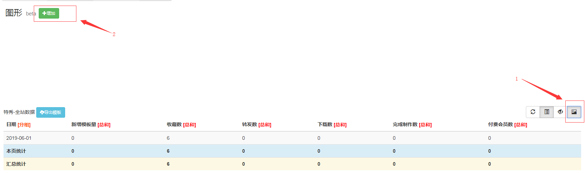
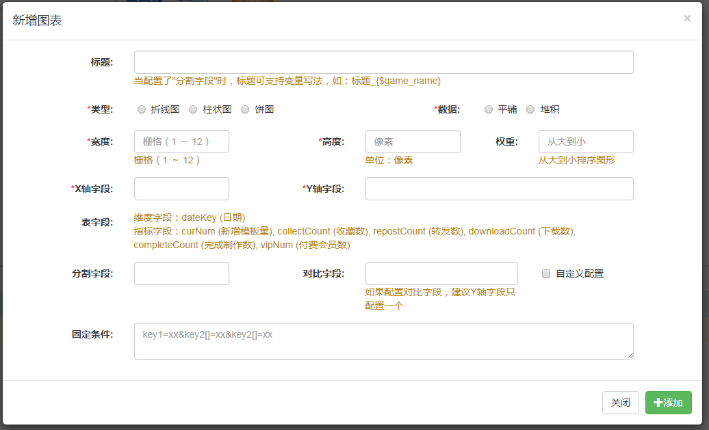

# 图表功能

## 开启配置
在页面配置的数据操作中，勾选可展现图形

## 添加图表

- 开启配置后，在diy页的右上角（标注1）点击```增加图表```按钮
- 点击标注2中的```增加```，打开图表添加配置

## 图表添加配置

- 类型为选择对应的图表类型

- 宽度为x轴的数据段数量，权重为多个图表是的排序顺序

- 保存当前表格设置的的diy页地址，设置到菜单管理中，让页面打开时默认展示图表

  